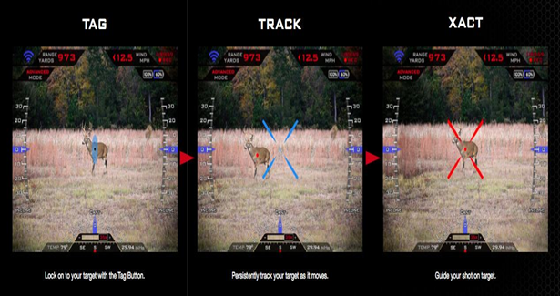
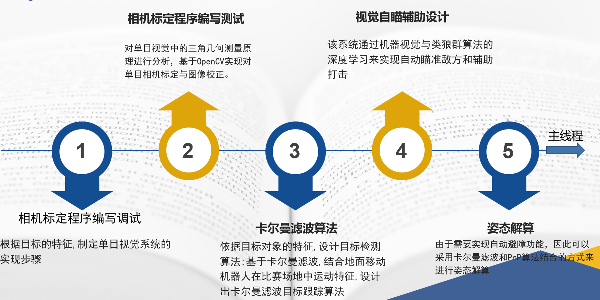
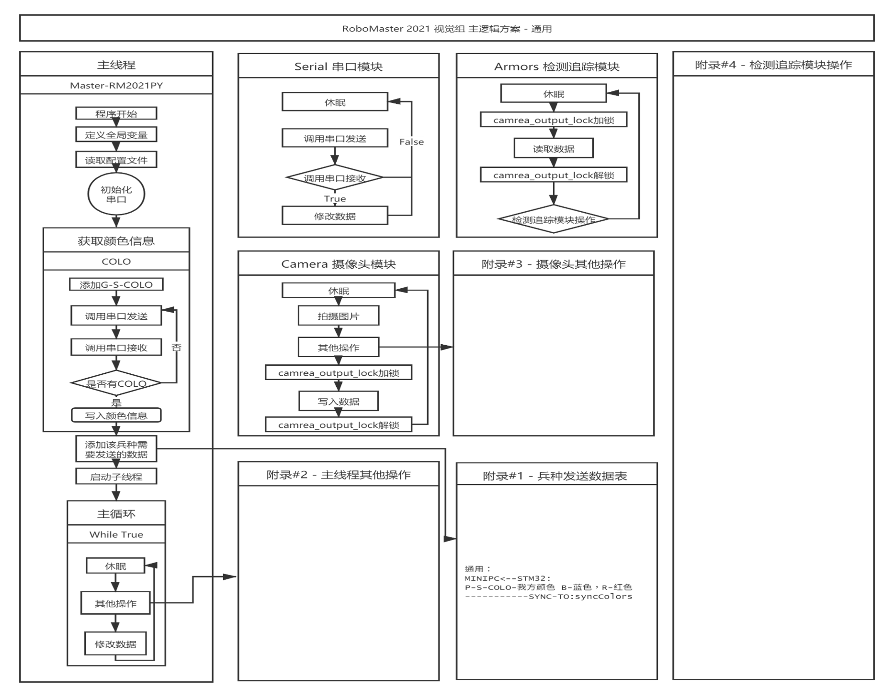
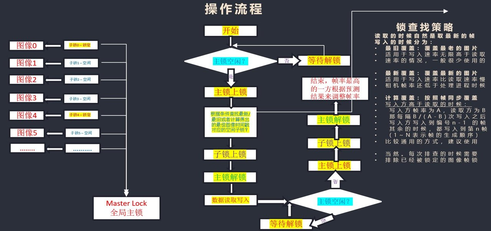
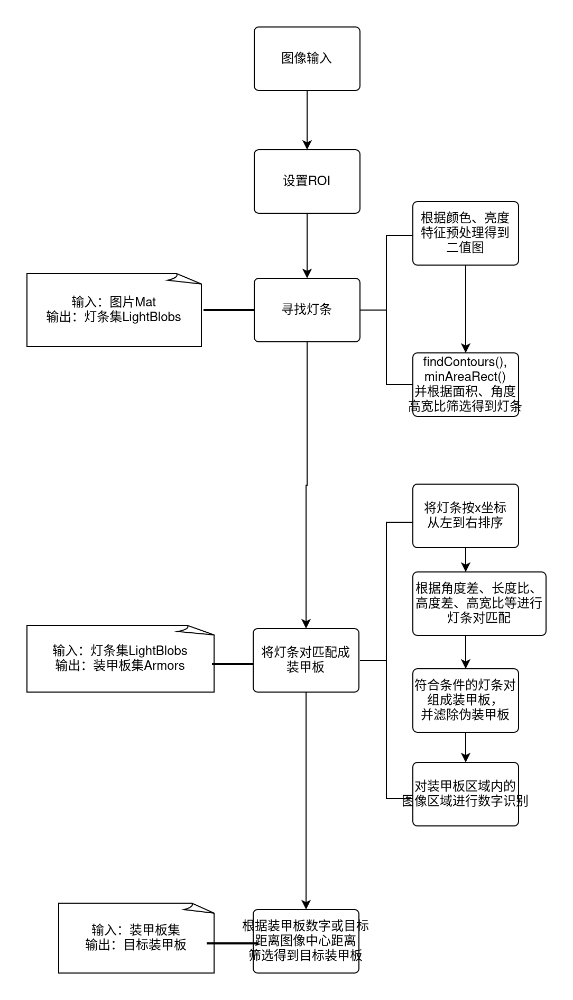
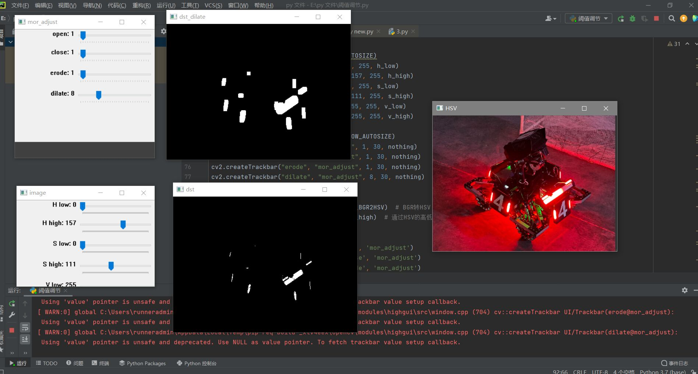
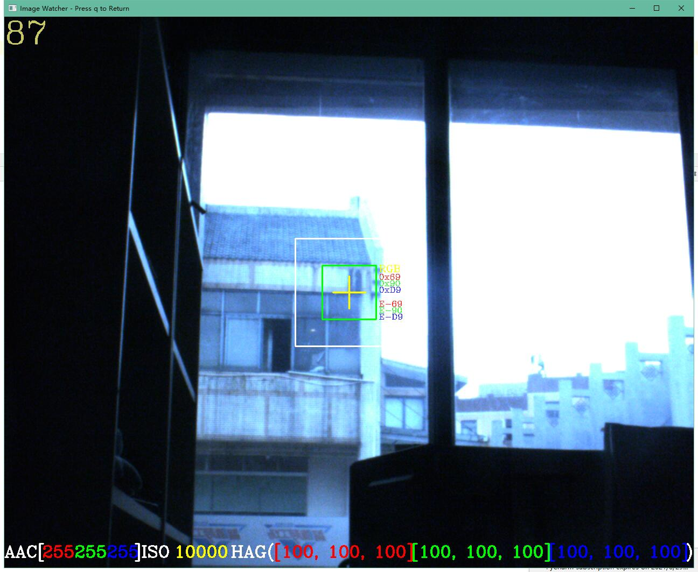

# haust-2021-vision-master

**河南科技大学 RoboMaster 鼎行.双创战队视觉组工程--装甲自瞄程序**




## 研究方法与思路



### 主体逻辑



### 调度方式



## 关键技术步骤



## 成果展示

> ==能实现较为精准的识别未被击打过的末端装甲模块并对其实现自动瞄准==





### 视频演示

==通讯及弹道解算== && ==自瞄==

https://github.com/1Carryon/Armors/video


## 文件结构

```
|   .gitignore
|   armor_detector.py
|   README.md
|   utils.py
|   分支-Masster.bat
|   分支-Paddles.bat
|   提交当前版本.bat
+---module
+---sample
|       1.png
```

## 运行环境

python3.7: opencv, numba, numpy

## 模块名称

armor_detector

### 模块接口

#### ArmorDetector([config])

config: 配置信息对象

参考：
```python
class _config:
    def __init__(self):
        # 图像转换大小
        self.WIDTH = 640
        self.HEIGHT = 480

        # HSV阈值参数
        self.hmin = 15
        self.hmax = 213
        self.smin = 3
        self.smax = 66
        self.vmin = 224
        self.vmax = 255

        # 形态学预处理参数
        self.open = 8
        self.close = 13
        self.erode = 4
        self.dilate = 9

        # 装甲板筛选参数
        self.area_threshold = 50  # 面积
        self.w_h_ratio = 1.1  # 长宽比例
```


#### ArmorDetector::detect(input_frame, [debug])->list

Args:

1. input_frame: 需要识别的二维图像区域用过OpenCV读取

2. debug: 用于显示调试界面(debug=True显示调试界面)

Return:

armors: 包含多个装甲板信息的list，每个元素为一个装甲板。 
eg. [arm0, arm1, ...]. armor[0]: 中心坐标(x, y); armor[1-4]: 装甲板内部顶点坐标